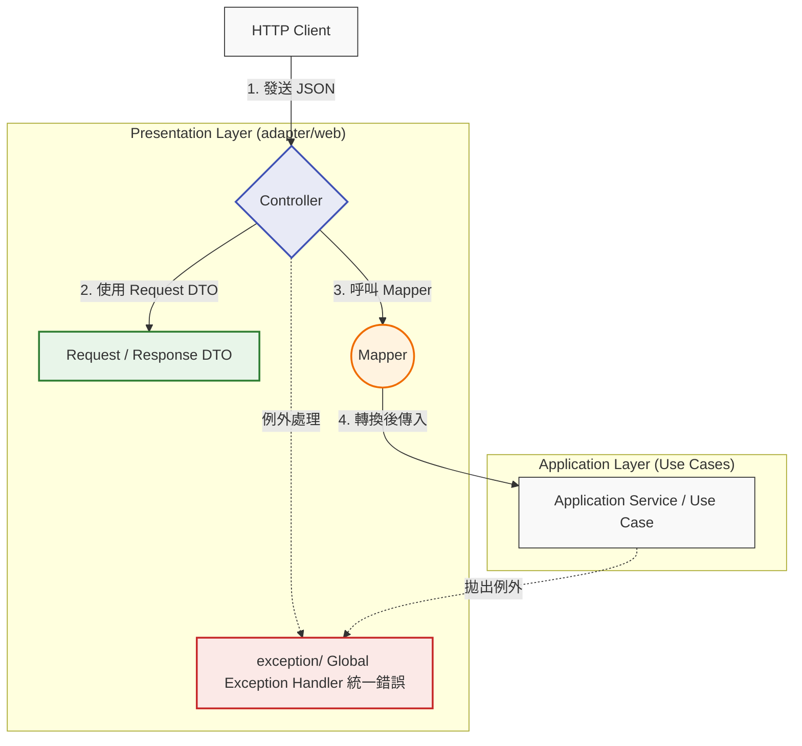
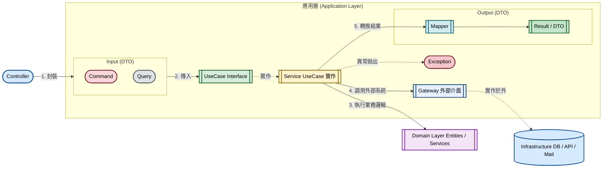
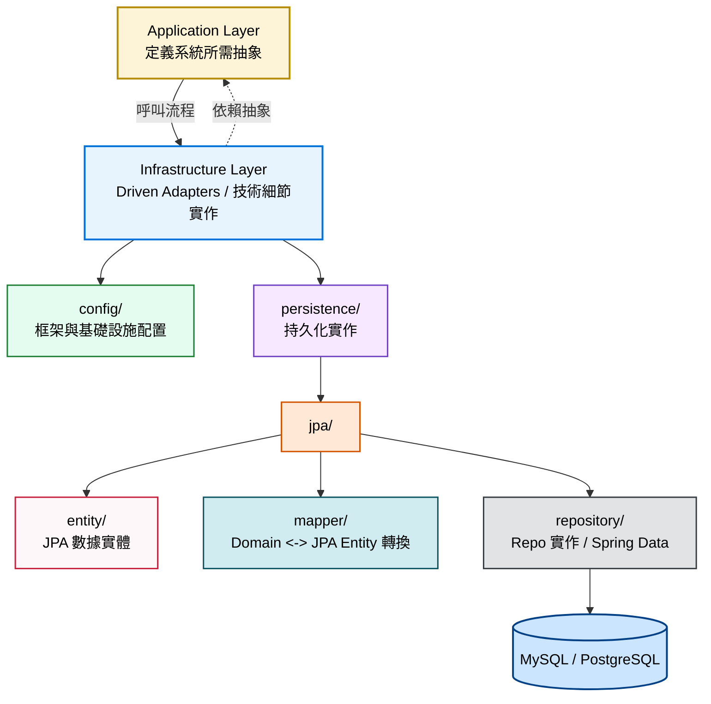
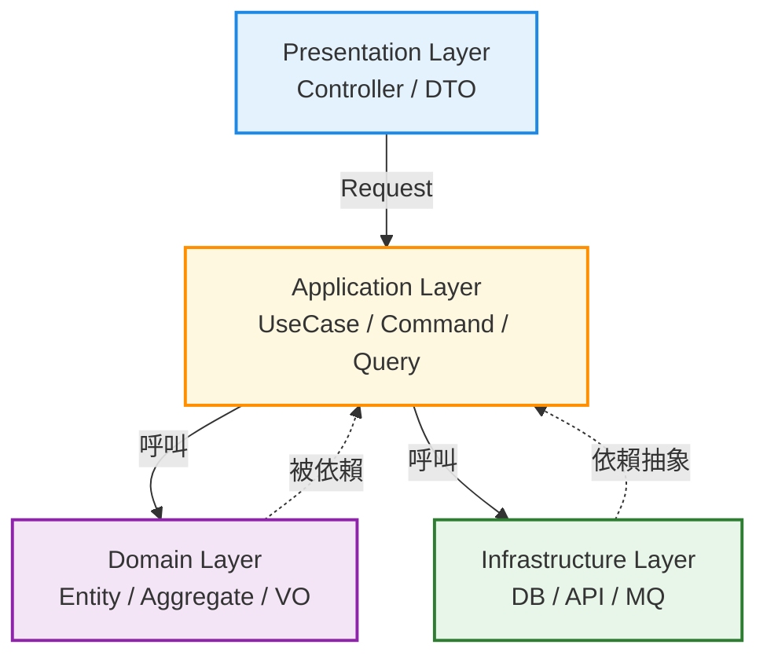

# UP4 專案規範指南

前言:
延續上次介紹過的 DDD 與 Clean Architecture，
未來 UP4 的專案架構也會遵循這個模式開發。

「這樣做的好處是，未來如果我們要更換資料庫或升級框架，核心業務邏輯（Domain）完全不需要改動，能大幅降低維護成本。」

## 專案架構遵循 DDD + Clean Architecture 分層架構
基本上是使用 Clean Architecture，但有些調整是跟六邊型架構較相似，所以嚴格來說是混合架構。
如下圖所示，整個架構分為四個層次，

最核心的原則是『依賴規則』：外層可以依賴內層，但內層（也就是我們的 Domain 層）必須保持單純，絕對不能依賴任何外層實作。
<font color="red">⚠ 依賴方向規則： 外層可依賴內層，  內層（Domain） 不可依賴外層</font>
>
><font color="red">**方向性如下**</font>
**Presentation → Application → Domain
Infrastructure 則是實作 Domain 的介面（依賴反轉）**
👉 不要直接依賴具體做法，要依賴共同規則, 這就是 [依賴反轉](#依賴反轉)（Dependency Inversion Principle, DIP） 的核心。


---

## 專案結構規範
依照上述分層架構，主要分成四個 package。
:::success
* **(1) adapter**
負責與外部使用者互動（如 REST API）。
* **(2) application**
協調領域物件執行用例流程，處理 Command/Query、Result 與 Domain 之間的轉換。
* **(3) domain**
核心業務邏輯所在，定義了實體（Entity）與 Repository 的介面，保持純粹性。
* **(4) infrastructure**
處理技術細節，如資料庫實作（JPA）、外部套件配置等。
:::


### <font color="red">**(一) Presentation Layer**</font>
- Presentation Layer(又稱 Adapter Layer)，是系統的最外層，負責處理所有「外部世界」與「內部應用核心」之間的溝通橋樑，核心任務是隔離外部通訊協定與內部業務邏輯，讓 Application Layer 不需要知道請求是來自 HTTP、gRPC 還是 SOAP。
- 這裡使用的命名是 **adapter**，但是也有人使用 **interface**
- 在這一層，可以用不同的技術協議跟外部溝通，但<font color="purple">**大原則是都不應該包含業務邏輯**</font>，轉換完就交給 Use Case 處理。
- **以<font color="red"> 通訊協定 </font>分類**
目前規劃通訊協定分三種，分別是 **<font color="red">grpc、soap、web</font>**，若未來要增加一個 mq 進入點也可以。
- 每個通訊協定，有自己的 controller, dto, mapper, exception。 soap 則是使用 "endpoint" 而非 "controller"。
    <details> 
    <summary>
        ⁉️ <font color="#BF00FF">**為什麼 SOAP 使用的是 "Endpoint"?  而 Endpoint 與 Controller 差別在哪裡** </font>
    </summary>
    <font color="gray">
    🪼 Endpoint：
    處理的是「訊息 (Message)」。SOAP 是一種通訊協定，請求通常全部發送到同一個 URL（即 Service Endpoint），再由 SOAP 封裝內的 Action 或 XML 內容決定呼叫哪個方法。
    🪼 Controller：
    源自 MVC 模式，通常處理「資源 (Resource)」或「頁面渲染 (View)」，並根據 URL 路徑進行路由。
    </font>    
    </details>
    
- 核心職責概覽

:::info
👀<font color="deepgray">Controller 是我們對外的唯一窗口。
    Controller 只負責把 Request DTO 轉成 Command/Query，再呼叫 Application Layer 的 Use Case；Domain 物件由 Application/Domain 內部建立。
這樣做能確保底下的 Application Layer 是一塊『淨土』，它不需要知道 HTTP 的細節，也不需要認識任何 DTO 結構。這就是我們強調的『內層不可依賴外層』。</font>

:::

- 以下說明各自職責，以 "web" 通訊 為例。
    ```
    adapter/
    ├── grpc/
    │   ├── controller/
    │   ├── dto/
    │   └── mapper/
    ├── soap/
    │   ├── dto/
    │   ├── endpoint/
    │   └── mapper/
    └── web/
        ├── controller/
        │   ├── ActivityController
        │   ├── HelloController
        │   └── LaleLayoutSettingController
        ├── dto/
        │   ├── request/
        │   └── response/
        ├── exception/
        │   └── GlobalExceptionHandler
        └── mapper/
            └── ActivityResponseMapper
    ```

    1.  <font color="green">**controller**: </font> 
 <font color="blue">請求進入點—是整個 Layer 的門面</font>，負責:
        - 接收並解析 HTTP 請求 (路徑參數、Query, Body) 
        - 呼叫對應的 Use Case (Application Layer)
        - 決定回傳的 HTTP 狀態
        - 依賴 use case 介面，而不是 service
        - 常見錯誤是 Controller 直接注入 Domain Service 或 Repository，這樣就破壞了層級隔離。
    2. <font color="green">**dto**:</font> 
<font color="blue">資料傳輸物件—DTO 讓 API 契約穩定，即使內部 Model 改變也不影響外部介面。</font>
        - 負責跟外部溝通的格式，將「外部看到的資料格式」與「內部 Domain Model」分開定義。
        - 區分 request、response 能有效防止，資料庫模型直接回給前端，保護了 API 的穩定性。
        - 命名上，如果是 web 專用的 DTO，命名上可以用 "自訂" + "RestRequest" 或者是 "WebRequest", 避免與 gRPC 的 DTO 搞混。
        -  <font color="green">**request/**</font>: 定義 Client 傳入的欄位與型別，通常搭配驗證注解。 (如 @NotNull、@Valid)
            ```java= 
            public record CreateActivityRequest(

                @NotBlank
                String name,

                @NotNull
                LocalDateTime startAt,

                @NotNull
                LocalDateTime endAt

            ) {}
            ```
        -  <font color="green">**response/**</font>: 定義回傳給 Client 的欄位，可以隱藏不需要曝光的 Domain 欄位。這裡的 response 的對象，是前端、行動端、外部 API 調用者，決定最終呈現給使用者看的樣式。 

    3. <font color="green">**mapper**:</font>
     <font color="blue">物件轉換器—這一層確保 Controller 不直接操作 Domain Model，維持職責清晰。</font>
        - 代表 web 層負責將 Domain model 轉換成前端需要的格式，符合 adapter 層的轉換職責。
        - 需要確保它只依賴 domain 和 web/dto，它不該知道任何關於資料庫 (JPA) 的事情。不要混入業務判斷。
        -  <font color="purple">**RequestDTO → Domain Input**</font>：把外部輸入轉換成 Use Case 可接受的參數。
        -  <font color="purple">**Domain->ResponseDTO**</font>:  把內部業務物件「翻譯」成 Client 友好的格式。
            ```java=
            @Component
            public class ActivityResponseMapper {

                public ActivityResponse toResponse(Activity activity) {
                    return new ActivityResponse(
                        activity.getId(),
                        activity.getName(),
                        activity.getStartAt(),
                        activity.getEndAt()
                    );
                }
            }
            ```
    4. <font color="green">**exception**:</font>
        - Web 層的例外處理（`@ControllerAdvice`） 屬於 adapter 的責任，負責將內層拋出的業務語意異常轉換成通訊協定格式（如 HTTP Status）。
        - 攔截整個 Web Layer 拋出的例外，統一轉換成標準化的 HTTP 錯誤回應（例如 400 Bad Request、500 Internal Server Error），避免每個 Controller 各自重複處理錯誤邏輯，也防止 Stack Trace 直接外洩給 Client
            ```java=
            @RestControllerAdvice // 這是 @ControllerAdvice + @ResponseBody 的組合，適合 REST API
            public class GlobalExceptionHandler {

                // 專門捕捉自定義的業務異常
                @ExceptionHandler(BusinessException.class)
                public ResponseEntity<ErrorDTO> handleBusinessException(BusinessException ex) {
                    ErrorDTO error = new ErrorDTO(ex.getErrorCode(), ex.getMessage());
                    return new ResponseEntity<>(error, HttpStatus.BAD_REQUEST);
                }

                // 捕捉所有未預料的系統錯誤
                @ExceptionHandler(Exception.class)
                public ResponseEntity<String> handleGeneralException(Exception ex) {
                    return new ResponseEntity<>("系統發生未知錯誤", HttpStatus.INTERNAL_SERVER_ERROR);
                }
            }            
            ```
            
            <details>
            <summary>
            <font color="#BF00FF">⁉️ @ControllerAdvice 用途為何? </font>
            </summary>
             <font color="gray">
            @ControllerAdvice 是一個非常強大的「全域後勤補給站」
            簡單來說，如果你有一百個 Controller，你一定不希望在每一份 Controller 程式碼裡都寫一遍 try-catch 來處理報錯。@ControllerAdvice 就是用來解決這個問題的。
            它主要有三個核心功能，其中最常用的是第一個：

            1. 全域異常處理 (Global Exception Handling) —— **最常用**
            配合 `@ExceptionHandler` 使用。當任何一個 Controller 拋出異常時，這個攔截器會自動跳出來接住它，並回傳統一的 JSON 格式給前端。
                * **優點**：你的 Controller 會變得非常乾淨，只需要處理「成功」的邏輯，所有「失敗」的邏輯（如 `UserNotFoundException`）都統一交給它。
                * Spring 會選「最精確」的：
                ```java=
                @ExceptionHandler(Exception.class)
                @ExceptionHandler(RuntimeException.class)
                @ExceptionHandler(NullPointerException.class)
                ```
            2. 全域資料綁定 (@ModelAttribute)
            如果你希望**所有的** Controller 在回傳給前端時，都自動帶上某些共通資訊（例如：目前登入的使用者資訊、系統版本號），你可以寫在這裡。
            但 Rest API 比較少用到，因為這個主要是用來綁定表單資料、query、parameter、path 以外的一般 request 參數，不是拿來吃 json 的。
            ```java=
            @ModelAttribute
            public void addGlobal(Model model) {
                model.addAttribute("appName", "MySystem");
            }            
            ```

            3. 全域資料綁定 (@InitBinder)
            較少用，用來統一設定自定義的參數轉換邏輯（例如：統一規定前端傳來的日期字串 `yyyy-MM-dd` 要如何轉成 Java 的 `LocalDate`）。
            ```java=
            @InitBinder
            public void initBinder(WebDataBinder binder) {
                // 自訂轉換
            }
            ```
            </font>
            </details>
            
            
            

### <font color="blue">**(二) Application Layer**</font>
Application Layer（應用層）是系統的業務流程編排中心，負責協調 Domain 物件完成具體的使用案例。

- 核心工作如下
    1.  <font color="#ff00ff">**編排業務流程**</font>
它是把 Domain 層的各種物件（Entity, Value Object, Domain Service）組合起來，完成一個特定的使用案例 (Use Case)。
        - 範例：
        處理「註冊活動」時，它會先叫 Domain 層檢查活動是否額滿，再叫 Domain 層建立報名紀錄，最後呼叫應用層所依賴的通知服務介面，由基礎設施層提供實作並寄出通知信。
    2. <font color="#ff00ff">**處理資料轉換**</font>
        - 進入： 將外部傳入的 Command 或 Query 轉化為 Domain 層聽得懂的語言（Domain Object、Domain 所需參數、Use Case 所需資料）。
        - 出去： 將 Domain Entity 轉化為只包含必要欄位的 DTO (Response)，保護內部資料不外洩。
    3. <font color="#ff00ff">**定義外部界限**</font>
這是 Application Layer 中「抽象依賴定義」的職責
        * 應用層會宣告：「我需要一個能存取活動的工具（ActivityRepository 介面）」，但它不關心這個工具背後是 MySQL、MongoDB 還是外部 API。
        * 這種「宣告需求」的行為，確保了應用層的純淨與可測試性。
    4. <font color="#ff00ff">**處理橫切關注點**</font>
一些不屬於業務邏輯，但為了執行流程必須做的雜事：
        * 交易控制：常由 Application Service / Use Case 邊界負責
        * 權限檢查：可在 Application Layer，也可能在 Adapter / Security 機制處理
        * Logging：常是 AOP、Filter、Interceptor 或 Infrastructure 處理，不一定在 Application Layer
- 核心職責概覽


- 以下依資料夾結構說明各自職責
    ```
    application/
    ├── command/        (命令：處理寫入/變更邏輯)
    ├── exception/      (應用層專屬異常)
    ├── mapper/         (應用層數據轉換)
    ├── usecase/        (輸入埠：UseCase 介面，讓 controller 呼叫)
    ├── gateway/        (非 Domain 的外部介面：如 MessagePublisher, FileStoragePort)   
    ├── query/          (查詢：處理唯讀邏輯)
    ├── result/         (查詢結果物件)
    └── service/        (實作 UseCase，依賴 Domain Repository 與其他 Out Port)
    ```

    1.  <font color="green">**command**: </font>
        - 有業務意圖，職責為對內，它表達的是系統要執行某個特定變更操作。
        - 封裝來自外部的寫入請求資料，作為 Use Case 的輸入參數。
        - 是純粹的 Java 物件，不應看到任何註解。與 web\dto\request 還是有區別。
        - 描述寫入意圖，封裝變更操作的輸入資料，例如 CreateOrderCommand。通常是不可變物件（immutable），清楚表達「要做什麼」，並可在此做基本的格式驗證。
        ```java=
        public record CreateActivityCommand(
            String name,
            LocalDateTime startAt,
            LocalDateTime endAt
        ) {}
        ```
        <details>
        <summary>⁉️<font color="#BF00FF"> 為什麼 command 不能直接取代 web.dto.request ?</font></summary>
                <font color="gray">
                有些專案為了簡化，會使用 application.command 取代 web.dto.request，當 UI 呼叫 api 時，Controller 可直接將 JSON 反序列化為 "xxxCommand"，這時，也許可以少寫 Web DTO，但是為了避免應用層的 command 被 Web 註解污             染，像是 @JsonProperty，通常會建議分開。</font>
        </details>
     
  2. <font color="green">**exception**:</font>  
   定義屬於 Application Layer 的例外，代表「Use Case 執行過程中的錯誤」。  
   這些例外通常與**流程協調或應用語意**有關，而非純粹的 Domain 規則，例如：
       - 找不到資料（ActivityNotFoundException）
       - 已存在（ActivityAlreadyExistsException）
       - 權限不足（AccessDeniedException）

       目的在於：
       - 提供上層（Controller / Handler）可辨識的錯誤語意
       - 避免直接使用通用 Exception（如 RuntimeException）
       ```java=
       public class ActivityNotFoundException extends RuntimeException {
           public ActivityNotFoundException(Long id) {
               super("Activity not found: " + id);
           }
       }

       public class ActivityAlreadyExistsException extends RuntimeException {
           public ActivityAlreadyExistsException(String name) {
               super("Activity already exists: " + name);
           }
       }
        ```
    3. <font color="green">**mapper**: </font>        
        - 應用層的資料轉換，負責在 Command/Query 與 Domain Model 之間、或 Domain Model 與 Result 之間做轉換，讓各層的資料結構保持獨立。
        ```java=
        @Component
        public class ActivityMapper {

            public ActivityResult toResult(Activity activity) {
                return new ActivityResult(
                    activity.getId(),
                    activity.getName(),
                    activity.getStartAt(),
                    activity.getEndAt(),
                    activity.getStatus().name()
                );
            }
        }
        ```
    4. <font color="green">**usecase**: </font> 
        - Use Case 介面。定義應用層 "能做什麼"。
        - 宣告 UseCase 介面，是外部呼叫應用層的唯一契約。例如 CreateOrderUseCase、GetOrderQuery，讓上層（如 Controller）只依賴介面，不依賴實作。
        ```java=
        // 寫入類 Use Case
        public interface CreateOrderUseCase {
            Long execute(CreateOrderCommand command);
        }

        // 查詢類 Use Case
        public interface GetOrderUseCase {
            // 傳入 Query，回傳 Result
            OrderResult execute(OrderQuery query);
        }
        ```
    5. <font color="green">**gateway**:</font>  
       定義 Application Layer 對外部系統所需的抽象能力，用於隔離技術實作與業務流程。
       常見包含：
       - 外部服務呼叫（Email、SMS、Payment）
       - 訊息發送（EventPublisher / Message Bus）
       - 查詢服務（CQRS Read Model）
       - 快取操作（Cache）

       這些介面只描述「需要什麼能力」，不關心底層是 DB、API 或其他技術，
       其具體實作由 Infrastructure Layer 提供。

       ※ gateway 的設計應以 Use Case 為導向，而非技術類型分類。
       
    6. <font color="green">**query**: </font>
       描述查詢意圖，封裝唯讀操作的輸入條件，遵循 CQRS 原則，與 Command 分離，且不產生任何狀態變更。
       Query 本身不包含業務邏輯，僅作為資料載體，並作為查詢流程的輸入模型。
       ```java=
       public record GetActivityQuery(
           Long id
       ) {}

       public record ListActivityQuery(
           String keyword,
           int page,
           int size
       ) {}
    7. <font color="green">**result**:</font>  
       作為 Query 的回傳模型（DTO），封裝查詢結果，專為讀取端設計。
       result 與 Domain Model 解耦，僅包含呼叫端所需欄位，
       以避免直接暴露 Entity，提升安全性與查詢效率。

       ```java=
       public record ActivityResult(
           Long id,
           String name,
           LocalDateTime startAt,
           LocalDateTime endAt,
           String status
       ) {}
        ```    
     
    8. <font color="green">**service**:</font>  
   Application Service 為 Use Case 的實作，負責編排業務流程，是應用層的核心。
   Application Service 通常對應一組 Use Case（Command / Query）的執行入口。
   Application Service 關心的是「事情怎麼發生」，而 Domain 關心的是「什麼是正確的」。
   Application Service 不承載核心業務規則，而是負責「流程的組織與執行」。
       回傳資料通常為 Result / Output Model，再由 Presentation 層轉為 Response DTO。

       主要職責：
       - 協調 Domain 物件與外部依賴（如 Repository、Gateway）
       - 控制流程順序與交易邊界（Transaction）
       - 處理例外與流程控制
       ```java=
       @Service
       @RequiredArgsConstructor
       @Transactional
       public class ActivityService {

           private final ActivityRepository activityRepository;
           private final ActivityMapper mapper;

           // ── 寫入 ──────────────────────────────────────────
           public Long create(CreateActivityCommand command) {
               Activity activity = Activity.create(
                   command.name(),
                   command.startAt(),
                   command.endAt()
               );
               return activityRepository.save(activity).getId();
           }

           // ── 查詢 ──────────────────────────────────────────
           @Transactional(readOnly = true)
           public ActivityResult getById(Long id) {
               Activity activity = activityRepository.findById(id)
                   .orElseThrow(() -> new ActivityNotFoundException(id));
               return mapper.toResult(activity);
           }

           @Transactional(readOnly = true)
           public List<ActivityResult> getAll() {
               return activityRepository.findAll()
                   .stream()
                   .map(mapper::toResult)
                   .toList();
           }
       }
       ```
### <font color="blue">**(三) Domain Layer**</font>
<font color="red">
Domain Layer（領域層）是系統的核心，專注於表達與實現業務規則，
不關心資料庫、框架或外部技術細節。
</font>

- Domain Layer 關心的是「什麼是正確的業務狀態」，而不是「流程怎麼執行」。
- 它負責用程式碼精確描述業務概念與規則，並維持模型的一致性與正確性，是整個系統中最穩定、最純粹的一層。
- 核心業務規則應集中於此層實現。


- 核心職責概覽


- 以下依資料夾結構說明各自職責
    
    ```
    domain/
    ├── model/                 - [領域模型] 存放業務邏輯的核心對象
    │   ├── aggregate/         - [聚合] 業務邊界的最小單位，確保數據一致性的入口
    │   ├── entity/            - [實體] 具有唯一標識（ID）且有生命週期的對象
    │   └── vo/                - [值對象] 無唯一標識，僅由其屬性定義的對象（如 Email, Money）
    ├── repository/            - [介面] 定義領域對資料存取的需求 (Interface Only)
    ├── exception/             - 業務規則違反時的例外處理
    └── service/               - [領域服務] 處理無法歸類於單一實體的跨實體業務邏輯
        └── UserDomainService  - 執行純粹的業務計算或驗證
    ```
    *  <font color="green">**model** (領域模型):</font>
     Domain Layer 的核心，負責表達業務概念與規則。  
  在 DDD 中，主要由 Aggregate、Entity、Value Object 組成。
  Aggregate 負責「一致性」，Entity 負責「身分」，Value Object 負責「語意」。
  Domain Model 應避免退化為僅有資料的結構（Anemic Model），應將業務行為封裝於模型內。

        1. <font color="#FF65FF">**aggregate（聚合）**</font>
            - 定義：業務一致性的邊界，對外只能透過 **Aggregate Root** 操作內部狀態  
            - 核心職責：
              - 強制執行不變條件（Invariant）
              - 控制內部 Entity 的生命週期
              - 作為交易的一致性邊界
            ```java=
            public class Order {  // Aggregate Root
                private List<OrderItem> items;

                public void addItem(ProductId productId, Quantity qty, Money price) {
                    validateOrderIsOpen();
                    this.items.add(new OrderItem(productId, qty, price));
                }
            }
            ```
        2. <font color="#FF65FF">**entity (實體)**</font>
            - 定義：具有唯一識別（ID）與生命週期的業務物件
            - 核心職責：
                - 封裝業務行為（而非僅作為資料容器）
                - 透過 ID 維持身分與狀態變化
                - 管理自身的業務規則
            ```java=
            public class OrderItem {
                private OrderItemId id;
                private Quantity quantity;
                private Money unitPrice;

                public Money calculateSubtotal() {
                    return unitPrice.multiply(quantity.getValue());
                }
            }
            ```
        3. <font color="#FF65FF">**vo (值物件 value object)**</font>
            - 定義：由屬性定義的不可變物件，無唯一識別
            - 核心職責：
                - 表達業務概念（如 Money、Email）
                - 封裝驗證與計算邏輯
                - 取代基本型別（避免 Primitive Obsession）4. 
            ```java=
                public record Money(BigDecimal amount, Currency currency) {
                    public Money {
                        if (amount.compareTo(BigDecimal.ZERO) < 0)
                            throw new InvalidMoneyException("金額不可為負");
                    }

                    public Money add(Money other) {
                        if (!this.currency.equals(other.currency))
                            throw new CurrencyMismatchException();
                        return new Money(this.amount.add(other.amount), this.currency);
                    }
                }           
            ```
    * <font color="green">**repository (資源庫介面)**</font>
        - 定義 Domain 對資料存取的需求，以介面形式表達，不關心實作細節。
        - 核心職責：
            - 以業務語言定義查詢與存取方法（而非技術導向）
            - 作為 Aggregate 的存取邊界，通常以聚合根為操作單位
            - 維持依賴反轉原則（DIP），實作由 Infrastructure Layer 提供
        ```java=
          public interface ActivityRepository {
              Optional<Activity> findById(ActivityId id);
              List<Activity> findActiveByUserId(UserId userId);
              void save(Activity activity);
          }

          public interface LayoutRepository {
              Optional<Layout> findById(LayoutId id);
              void save(Layout layout);
          }
        ```
    * <font color="green">**service (領域服務)**</font>
         - 用於承載無法歸屬於單一 Entity 或 Aggregate 的業務邏輯。
         - 核心職責：
              - 協調多個 Entity / Aggregate 完成業務計算或驗證
              - 封裝純業務規則，不依賴基礎設施
              - 若邏輯可歸屬於 Entity，應優先放入模型內（避免貧血模型）
        ```java=
        public class UserDomainService {

            // 跨兩個 Aggregate 的業務驗證，放在任一個都不自然
            public boolean canUserJoinActivity(User user, Activity activity) {
                return user.isActive()
                    && activity.hasAvailableSlots()
                    && !activity.isAlreadyEnrolled(user.getId())
                    && user.getMemberLevel().satisfies(activity.getRequiredLevel());
            }
        }
        ```
    * <font color="green">**exception (業務規則例外處理)**</font>
        - 表示違反核心業務規則（Invariant）的錯誤，與技術或流程無關。

        - 特性：
          - 代表不可被破壞的業務規則
          - 與使用情境（Web / Batch / API）無關
          - 可直接用於測試業務邏輯

          例：
          - InsufficientBalanceException（餘額不可為負）
          - InvalidOrderStateException（訂單狀態不允許操作）
          - MemberLevelConflictException（會員等級衝突）
### <font color="blue">**(四) Infrastructure Layer**</font>
- Infrastructure Layer 是技術實作層，負責將 Domain 與 Application Layer 所定義的抽象介面，對接到實際的外部系統（如資料庫、框架與第三方服務）。
- 它屬於 Driven Adapter，由應用層驅動執行。
- 核心職責：
  - 實作 Repository、Gateway 等抽象介面
  - 整合資料庫、ORM（如 JPA）與外部服務
  - 負責框架設定與 Bean 組裝（config）
  - 進行資料模型轉換（如 Entity ↔ Domain）
- 常見內容：
  - 資料庫存取與 ORM 實作
  - Spring / Framework 設定與組裝
  - 第三方服務整合（API、MQ、Mail）
  - 序列化、連線、交易等技術細節

---
- 核心職責概覽:


- 以下依資料夾結構說明各自職責

    ```
    infrastructure/ (Driven Adapters - 技術細節實作)
        ├── config/      (框架與基礎設施配置)
        └── persistence/ (持久化實作)
            └── jpa/
                ├── entity/     (JPA 數據實體)
                ├── mapper/     (Domain <-> JPA Entity 轉換)
                └── repository/ (Repo 實作與 Spring Data 介面)
    ```
   
    1.  <font color="green">**config： 框架與基礎設施配置**</font>
         - 負責系統的框架設定與元件組裝，是 Infrastructure Layer 的初始化與整合入口。
         - 此層僅處理技術設定與組裝，不包含任何業務邏輯。
         - 核心職責：
           - 定義與註冊 Spring Bean（將實作注入至上層抽象）
           - 設定資料來源（DataSource）與連線池
           - 配置交易管理（TransactionManager）
           - 整合外部技術元件（如 JPA、Cache、MQ、第三方 API）
        
    2.  <font color="green">**persistence/ (持久化實作層)**:</font>
          Infrastructure Layer 的子模組，負責資料的存取與持久化實作。
   為避免不同技術耦合，通常會依實作技術分層（如 jpa / redis / elasticsearch）。
   └── jpa/（以 JPA 為例）
 🪼<font color="gray">為什麼要在 persistence 下多一層 jpa？因為未來你可能會並行使用 elasticSearch 或 redis，這樣分層能讓不同技術的實作互不干擾。 </font>   
        -  <font color="red">**entity: (JPA 數據實體 / Persistence Object)**</font>
            - 定義：對應資料庫結構的映射物件  
            - 核心職責：
              - 映射 Table / Column / 關聯關係
              - 承載 ORM 技術細節（如 Lazy Loading、關聯設定）
            - 特性：
              - 不包含業務邏輯
              - 結構可為效能或資料庫設計而調整（不需對齊 Domain Model）            
            ```java=
            @Entity
            @Table(name = "activity")
            public class ActivityJpaEntity {

            @Id
            @GeneratedValue(strategy = GenerationType.IDENTITY)
            private Long id;

            @Column(nullable = false)
            private String status;

            private Integer maxParticipants;
            }
            ```
        -  <font color="red">**mapper: (技術轉接器 / Mapping Layer)**</font> 
            - 定義：Domain 與 Persistence Model 的轉換層
            - 核心職責：
                - JPA Entity → Domain（讀取）
                - Domain → JPA Entity（寫入）
            - 目的：
                - 隔離資料庫結構與業務模型
                - 降低變更影響範圍
            ```java=
            @Component
            public class ActivityMapper {

                public Activity toDomain(ActivityJpaEntity e) {
                    return Activity.reconstitute(
                        ActivityId.of(e.getId()),
                        ActivityStatus.of(e.getStatus()),
                        Capacity.of(e.getMaxParticipants())
                    );
                }

                public ActivityJpaEntity toJpaEntity(Activity a) {
                    ActivityJpaEntity e = new ActivityJpaEntity();
                    e.setId(a.getId().getValue());
                    e.setStatus(a.getStatus().name());
                    e.setMaxParticipants(a.getCapacity().getValue());
                    return e;
                }
            }
            ```
        -  <font color="red">**repository: (資源庫實作與數據存取)**</font>
            - 定義：實作 Domain 定義的 Repository 介面，負責資料存取
            - 組成：
                - Spring Data Repository（技術層）
                - Repository 實作（應用橋接層）
            - 核心職責：
                - 呼叫資料存取工具（JPA / SQL）
                - 進行物件轉換（透過 mapper）
                - 對外提供 Domain / Application 所需資料
                ```java=
                public interface ActivityJpaRepository extends JpaRepository<ActivityJpaEntity, Long> {
                    List<ActivityJpaEntity> findByStatus(String status);
                }

                @Repository
                public class ActivityRepositoryImpl implements ActivityRepository {

                    private final ActivityJpaRepository jpaRepository;
                    private final ActivityMapper mapper;

                    @Override
                    public Optional<Activity> findById(ActivityId id) {
                        return jpaRepository.findById(id.getValue())
                                .map(mapper::toDomain);
                    }

                    @Override
                    public void save(Activity activity) {
                        jpaRepository.save(mapper.toJpaEntity(activity));
                    }
                }
                ```
---
## 一頁式架構總覽（Clean Architecture + CQRS）


- ⚠ 常見錯誤
❌ Domain 使用 JPA / Spring
❌ 回傳 Entity 給前端
❌ Repository 用 SQL 思維命名
❌ Application 寫業務規則
❌ Infrastructure 被上層依賴

-----------------------------------

## 分層依賴規範 checklist
🎯 一句話總結依賴規則
>依賴只能往內（Adapter → Application → Domain）
Infrastructure 只能實作，不可反向影響

---
### 1) 對應資料夾的依賴 checklist（加強版）

#### A. 依賴方向（必過）
- [ ] `domain..` **不得依賴** `application.. / adapter.. / infrastructure..`
- [ ] `application..` **不得依賴** `adapter.. / infrastructure..`
- [ ] `adapter..` **不得依賴** `infrastructure..`
- [ ] `infrastructure..` **可以依賴** `domain..` 與 `application..` 中定義的介面
- [ ] `domain..` **不得 import** `org.springframework..` [^1]

#### B. Repository（domain/repository）規則
- [ ] `com.flowring.up.domain.repository..` 內的 `*Repository` 型別應為 **介面**（interface）
- [ ] `com.flowring.up.infrastructure..` 可以 **實作** `domain.repository..`
- [ ] `com.flowring.up.application..` / `com.flowring.up.domain..` **不得依賴** `infrastructure.persistence.jpa.repository..`
- [ ] `com.flowring.up.adapter..` **不得依賴** `infrastructure.persistence.jpa.repository..`

#### C. Gateway（application/gateway）規則
- [ ] `com.flowring.up.application.gateway..` 內的 `*Gateway` 型別應為 **介面**（interface）
- [ ] `com.flowring.up.infrastructure..` 可以 **實作** `application.gateway..`
- [ ] `application..` 不得依賴任何 gateway 實作類別（只依賴介面）
- [ ] `adapter..` 不得直接呼叫 gateway（應透過 application service/usecase）

#### D. JPA 隔離（避免污染內圈）
- [ ] `@Entity / @Embeddable / @MappedSuperclass / @Converter` 只能出現在 `infrastructure.persistence.jpa..`
- [ ] `domain..` / `application..` **不得 import** `jakarta.persistence..`
- [ ] `adapter.web.controller..` 不得依賴 `infrastructure.persistence.jpa..` 任一 package

---

### 如何確保之後的架構依賴方向正確呢?
#### ArchUnit 套件: 
ArchUnit 就是架構規範的「執法者」。
```xml=
<dependency>
    <groupId>com.tngtech.archunit</groupId>
    <artifactId>archunit-junit5</artifactId>
    <version>1.3.0</version>
    <scope>test</scope>
</dependency>
```
- 「用程式碼測試架構規範」的 Java 測試庫。
- 核心用途：防止架構腐爛

我們在文件裡寫了無數次「==**內層不可依賴外層**==」、「Controller 不可直接呼叫 Repository」， <font color="red">**但實際上開發成員（或是未來的自己）很可能會為了趕進度或不小心，在程式碼裡偷偷 import 了不該出現的類別。**</font>
ArchUnit 的作用就是把這些「文字規範」變成「單元測試」。如果有人違反了你定義的 DDD 層次結構，測試就不會過，專案也就沒辦法 Build 成功。

至於，如何寫單元測試規範架構，等之後整個架構確定了，可以再補足這塊。

---
End!
