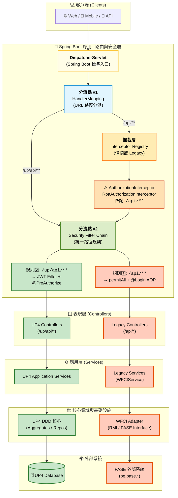

# 0428 WFCIService 改版新架構說明
>參考: [WFCIService 現行架構](http://hedgedoc.flowring.com/0HH3eSFVR_6OOIPdzLPRJw?view)

## 🎯 **關鍵變化**

- ✅ **UP4 功能**： 採用 DDD + Clean Architecture，直接存取資料庫
- ✅ **舊功能(Legacy)**： 繼續透過 wfci.jar 使用 RMI 呼叫 PASE 系統之 API
- ✅ **技術棧升級**： JDK 21 + Spring Boot 3.x + Spring Security
- ✅ **漸進式遷移**: 原本設計使用多 DispatcherServlet 配置，後來改成透過 Spring MVC 的 URL 路徑映射與 Security/Interceptor 規則分流- 

## 🎯 <font color="blue">架構圖</font> 
<!--
[](http://hedgedoc.flowring.com/uploads/6581b209-61b2-4812-b563-c66d69f9701f.svg "zoom in")
-->

### 🎈專案架構變更
- [](http://hedgedoc.flowring.com/uploads/f2568f44-6c1c-43ab-a3c6-597befaa0424.svg "點我放大")
    - 舊架構: 只有一個 WFCIService 
    - 新架構: 分成多個子模組
        1. 原本的 **WFCIService** (維持原樣)
        2. **UP**：  <font color="blue">適用 UP4 - 新架構</font>
        3. **AF**： <font color="blue">適用 AF 改版 - 新架構</font>
        4. **DMS**： <font color="blue">適用 DMS改版 - 新架構</font>
        5. **COMMON**： <font color="blue">共用 - 新架構</font>
  如下所示
    [](http://hedgedoc.flowring.com/uploads/40625a9a-fc7b-427f-90be-ba13672741f5.png "點我放大")


### 🎈 新架構 DDD + Clean Architecture 
> [UP4 專案架構指引](http://hedgedoc.flowring.com/_w5nxfUySIWDZZO5AebDMw)
---

## 🎯 策略
使用 **Strangler Pattern (絞殺者模式)**
 - **什麼是 Strangler Pattern？**
Strangler Pattern 是一種漸進式系統遷移策略，通過在舊系統外層包裹一個 Facade（門面），逐步將功能從舊系統遷移到新系統，最終完全替換掉舊系統。
✅ Spring Boot 的 DispatcherServlet 結合 HandlerMapping、Interceptor 和 
   SecurityFilterChain，實現了 Strangler Pattern 中的「應用程式內分流機制」。
   這樣可以在不改動舊系統的情況下，透過 URL 路徑規則漸進式地遷移功能。
- **核心步驟**
Strangler Pattern 的三個核心步驟，在單一系統中是這樣發生的：
    - Transform (轉化)：
    你在同一個專案中，用新的方式（DDD + Clean Architecture）寫好一個新功能（例如 /api/v2/task）。
    - Coexist (共存)：
    舊的代碼（Legacy Controller / wfci.jar）和新的代碼（UP4 Controller）同時存在於同一個執行環境中。
    - Eliminate (消除)：
    透過 URL 分流 ，舊入口轉到新入口。等到舊代碼完全沒人呼叫時，就可以直接把相關的 Package 刪掉。

### 🎯 混合架構的優勢
1. **漸進式遷移**: 
   - UP4 新功能使用新架構
   - 舊功能繼續運作
   - 降低風險，逐步重構

2. **技術債管理**:
   - 新功能不再依賴 wfci.jar
   - 未來可逐步遷移舊功能

3. **效能提升**:
   - UP4 直接存取資料庫，減少 RMI 網路開銷
   - 使用 JPA 快取和查詢優化

4. **可維護性**:
   - DDD 清晰的業務邏輯分層
   - Clean Architecture 的低耦合設計
   - Domain 層獨立於框架
   
## ✨ WFCIService 主要技術棧  
  
### <font color="#6425d0">核心  </font>
- **JDK**: 21  
- **Spring Boot**: 3.5.6  
- **Maven**: 構建工具  
### <font color="#6425d0"> Web 框架 </font> 
- Spring Web MVC  
- Spring Boot Starter Web  
- Tomcat (內嵌)  
### <font color="#6425d0">資料層</font>  
- Spring Data JPA  
- Jakarta Persistence API  
- SQL Server JDBC  
- Hibernate Validator    
### <font color="#6425d0">認證與授權  </font>
- Spring Security (新系統)  
- Apache Shiro (舊系統)  
- JWT (JJWT, Auth0) 
### <font color="#6425d0">JSON / 序列化  </font>
- Jackson (新系統預計使用) 
- FastJSON  (舊 WFCIService 使用)
- GSON: 預計移除
- Hutool: 引進 Hutool 的工具庫
### <font color="#6425d0">工具庫  </font>
- Lombok  
- MapStruct  
- Apache Commons (Lang, IO, Collections)  
- Guava   
### <font color="#6425d0">文檔 & 報表</font>  
- SpringDoc OpenAPI (Swagger)  
- POI (Excel)  
- iText (PDF)  
- JFreeChart  
### <font color="#6425d0">遠端呼叫 </font> 
- RMI (呼叫 PASE 系統)  
- Retrofit 2 (HTTP)   
### <font color="#6425d0">測試</font>  
- JUnit 5  
- Mockito  
- ArchUnit    
### <font color="#6425d0">模組結構 </font> 
```  
WFCIService  
├── wfci       (舊系統，RMI 呼叫 PASE)
├── up         ( UP4 新系統，DDD + Clean Architecture)  
├── common     (共用，Security、Filter)  
├── af         (AF-未來改版預留)  
└── dms        (文管-未來改版預留)  
```  
### <font color="#6425d0">關鍵特性  </font>  
- JWT 認證 (新系統)  
- Spring Security (統一安全)  
- JPA ORM (新系統)  
- RMI 整合 (舊系統)  
- Docker 支援  
- 漸進式遷移 (Strangler Pattern)
