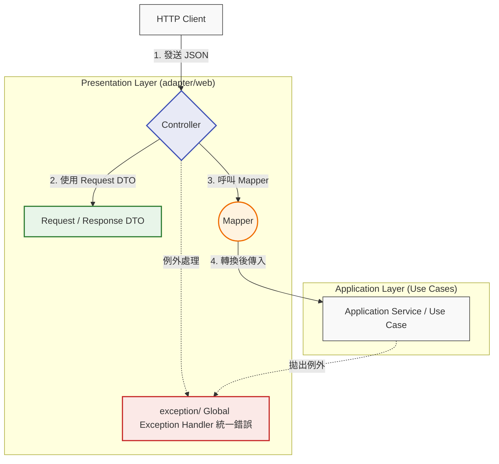
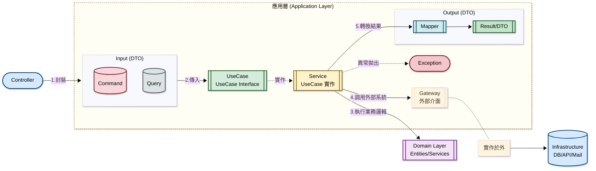
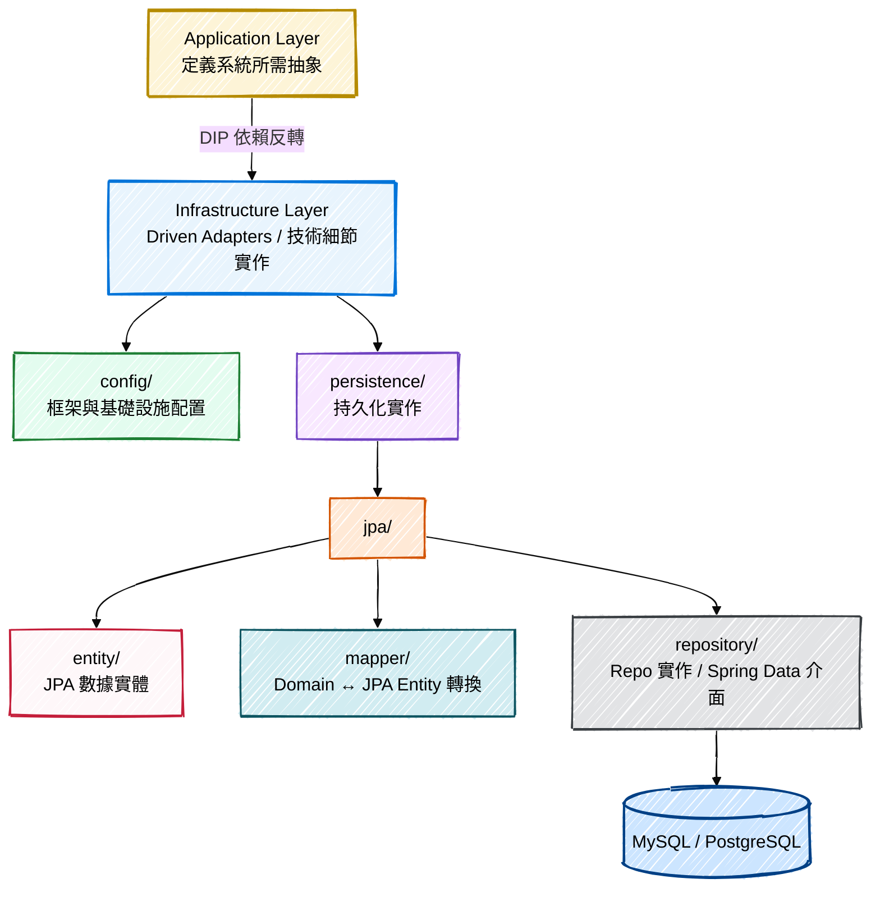

# UP4 專案規範文件

前言:
延續上次介紹過的 DDD 與 Clean Architecture，
未來 UP4 的專案架構也會遵循這個模式開發。

「這樣做的好處是，未來如果我們要更換資料庫或升級框架，核心業務邏輯（Domain）完全不需要改動，能大幅降低維護成本。」

## 專案架構遵循 DDD + Clean Architecture 分層架構
基本上是使用 clean Architecture，但有些調整是跟六邊型架構較相似，所以嚴格來說是混合架構。
如圖所示，整個架構分為四個層次，
最核心的原則是『依賴規則』：外層可以依賴內層，但內層（也就是我們的 Domain 層）必須保持單純，絕對不能依賴任何外層實作。
<font color="red">⚠ 依賴方向規則： 外層可依賴內層，  內層（Domain） 不可依賴外層</font>
>
><font color="red">**方向性如下**</font>
**Presentation → Application → Domain
Infrastructure 則是實作 Domain 的介面（依賴反轉）**
👉 不要直接依賴具體做法，要依賴共同規則, 這就是 [依賴反轉](#依賴反轉)（Dependency Inversion Principle, DIP） 的核心。


---

## 專案結構規範
依照上述分層架構，主要分成四個 package。
:::success
* **(1) adapter**： 
負責與外部使用者互動（如 REST API）。
* **(2) application**：
協調領域物件執行用例流程，處理 Command/Query、Result 與 Domain 之間的轉換。
* **(3) domain**： 
核心業務邏輯所在，定義了實體（Entity）與 Repository 的介面，保持純粹性。
* **(4) infrastructure**：
處理技術細節，如資料庫實作（JPA）、外部套件配置等。
:::


### <font color="red">**(一) Presentation Layer**</font>
- Presentation Layer(又稱 Adapter Layer)，是系統的最外層，負責處理所有「外部世界」與「內部應用核心」之間的溝通橋樑，核心任務是隔離外部通訊協定與內部業務邏輯，讓 Application Layer 不需要知道請求是來自 HTTP、gRPC 還是 SOAP。
- 這裡使用的命名是 **adapter**，但是也有人使用 **interface**
這裡可以用不同的技術協議跟外部溝通，但<font color="orange">**大原則是都不應該包含業務邏輯**</font>，轉換完就交給 Use Case 處理。
- **以<font color="red"> 通訊協定 </font>分類**
通訊協定分三種，分別是  <font color="red">1.grpc, 2.soap, 3.web</font>, 若未來要增加一個 mq 進入點也可以。
- 每個通訊協定，有自己的 controller, dto, mapper, exception。 soap 則是使用 "endpoint" 而非 "controller"。
    <details> 

    <summary>
        ⁉️ <font color="#BF00FF">**為什麼 SOAP 使用的是 "Endpoint"?  而 Endpoint 與 Controller 差別在哪裡** </font>
    </summary>
    <font color="gray">
    🪼 Endpoint：
    處理的是「訊息 (Message)」。SOAP 是一種通訊協定，請求通常全部發送到同一個 URL（即 Service Endpoint），再由 SOAP 封裝內的 Action 或 XML 內容決定呼叫哪個方法。
    🪼 Controller：
    源自 MVC 模式，通常處理「資源 (Resource)」或「頁面渲染 (View)」，並根據 URL 路徑進行路由。
    </font>    
    </details>
    
- 核心職責概覽

:::info
👀<font color="deepgray">可以看到，Controller 是我們對外的唯一窗口。
    Controller 只負責把 Request DTO 轉成 Command/Query，再呼叫 Application Layer 的 Use Case；Domain 物件由 Application/Domain 內部建立。
這樣做能確保底下的 Application Layer 是一塊『淨土』，它不需要知道 HTTP 的細節，也不需要認識任何 DTO 結構。這就是我們強調的『內層不可依賴外層』。</font>

:::

- 以下依資料夾結構說明各自職責，以其中一個通訊 "web" 為例。
    ```
    adapter/
    ├── grpc/
    │   ├── controller/
    │   ├── dto/
    │   └── mapper/
    ├── soap/
    │   ├── dto/
    │   ├── endpoint/
    │   └── mapper/
    └── web/
        ├── controller/
        │   ├── ActivityController
        │   ├── HelloController
        │   └── LaleLayoutSettingController
        ├── dto/
        │   ├── request/
        │   └── response/
        ├── exception/
        │   └── GlobalExceptionHandler
        └── mapper/
            └── ActivityResponseMapper
    ```

    1.  <font color="green">**controller**: </font> 
 <font color="blue">請求進入點—是整個 Layer 的門面</font>，負責:
        - 接收並解析 HTTP 請求 (路徑參數、Query, Body) 
        - 呼叫對應的 Use Case (Application Layer)
        - 決定回傳的 HTTP 狀態
        - 依賴 use case 介面(application.port.in)，而不是 service
        - 常見錯誤是 Controller 直接注入 Domain Service 或 Repository，這樣就破壞了層級隔離。
    2. <font color="green">**dto**:</font> 
<font color="blue">資料傳輸物件—DTO 讓 API 契約穩定，即使內部 Model 改變也不影響外部介面。</font>
        - 負責跟外部溝通的格式，將「外部看到的資料格式」與「內部 Domain Model」分開定義。
        - 區分 request、response 能有效防止，資料庫模型直接回給前端，保護了 API 的穩定性。
        - 命名上，如果是 web 專用的 DTO，命名上可以用 "自訂" + "RestRequest" 或者是 "WebRequest", 避免與 gRPC 的 DTO 搞混。
        -  <font color="green">**request/**</font>: 定義 Client 傳入的欄位與型別，通常搭配驗證注解。 (如 @NotNull、@Valid)
            ```java= 
            public record CreateActivityRequest(

                @NotBlank
                String name,

                @NotNull
                LocalDateTime startAt,

                @NotNull
                LocalDateTime endAt

            ) {}
            ```
        -  <font color="green">**response/**</font>: 定義回傳給 Client 的欄位，可以隱藏不需要曝光的 Domain 欄位。這裡的 response 的對象，是前端、行動端、外部 API 調用者，決定最終呈現給使用者看的樣式。 

    3. <font color="green">**mapper**:</font>
     <font color="blue">物件轉換器—這一層確保 Controller 不直接操作 Domain Model，維持職責清晰。</font>
        - 代表 web 層負責將 Domain model 轉換成前端需要的格式，符合 adapter 層的轉換職責。
        - 需要確保它只依賴 domain 和 web/dto，它不該知道任何關於資料庫(JPA)的事情。不要混入業務判斷。
        - 通常一個 mapper 會同時處理 in/out。
        -  <font color="purple">**Domain->ResponseDTO**</font>:  把內部業務物件「翻譯」成 Client 友好的格式。
        -  <font color="purple">**RequestDTO → Domain Input**</font>：把外部輸入轉換成 Use Case 可接受的參數。
            ```java=
            @Component
            public class ActivityResponseMapper {

                public ActivityResponse toResponse(Activity activity) {
                    return new ActivityResponse(
                        activity.getId(),
                        activity.getName(),
                        activity.getStartAt(),
                        activity.getEndAt()
                    );
                }
            }
            ```
    4. <font color="green">**exception**:</font>
        - Web 層的例外處理（`@ControllerAdvice`） 屬於 adapter 的責任，負責將內層拋出的業務語意異常轉換成通訊協定格式（如 HTTP Status）。
        - 攔截整個 Web Layer 拋出的例外，統一轉換成標準化的 HTTP 錯誤回應（例如 400 Bad Request、500 Internal Server Error），避免每個 Controller 各自重複處理錯誤邏輯，也防止 Stack Trace 直接外洩給 Client
            ```java=
            @RestControllerAdvice // 這是 @ControllerAdvice + @ResponseBody 的組合，適合 REST API
            public class GlobalExceptionHandler {

                // 專門捕捉自定義的業務異常
                @ExceptionHandler(BusinessException.class)
                public ResponseEntity<ErrorDTO> handleBusinessException(BusinessException ex) {
                    ErrorDTO error = new ErrorDTO(ex.getErrorCode(), ex.getMessage());
                    return new ResponseEntity<>(error, HttpStatus.BAD_REQUEST);
                }

                // 捕捉所有未預料的系統錯誤
                @ExceptionHandler(Exception.class)
                public ResponseEntity<String> handleGeneralException(Exception ex) {
                    return new ResponseEntity<>("系統發生未知錯誤", HttpStatus.INTERNAL_SERVER_ERROR);
                }
            }            
            ```
            :::spoiler  <font color="#BF00FF">⁉️ **@ControllerAdvice**</font>
             <font color="gray">
            @ControllerAdvice 是一個非常強大的「全域後勤補給站」
            簡單來說，如果你有一百個 Controller，你一定不希望在每一份 Controller 程式碼裡都寫一遍 try-catch 來處理報錯。@ControllerAdvice 就是用來解決這個問題的。
            它主要有三個核心功能，其中最常用的是第一個：

            1. 全域異常處理 (Global Exception Handling) —— **最常用**
            配合 `@ExceptionHandler` 使用。當任何一個 Controller 拋出異常時，這個攔截器會自動跳出來接住它，並回傳統一的 JSON 格式給前端。

                * **優點**：你的 Controller 會變得非常乾淨，只需要處理「成功」的邏輯，所有「失敗」的邏輯（如 `UserNotFoundException`）都統一交給它。

            2. 全域資料綁定 (@ModelAttribute)
            如果你希望**所有的** Controller 在回傳給前端時，都自動帶上某些共通資訊（例如：目前登入的使用者資訊、系統版本號），你可以寫在這裡。

            3. 全域請求預處理 (@InitBinder)
            用來統一設定自定義的參數轉換邏輯（例如：統一規定前端傳來的日期字串 `yyyy-MM-dd` 要如何轉成 Java 的 `LocalDate`）。
            </font>
            :::            

### <font color="blue">**(二) Application Layer**</font>
Application Layer（應用層）是系統的業務流程編排中心，負責協調 Domain 物件完成具體的使用案例。

- 核心工作如下
    1.  <font color="#ff00ff">**編排業務流程**</font>
它是把 Domain 層的各種物件（Entity, Value Object, Domain Service）組合起來，完成一個特定的使用案例 (Use Case)。
        - 範例：
        處理「註冊活動」時，它會先叫 Domain 層檢查活動是否額滿，再叫 Domain 層建立報名紀錄，最後透過 Port 叫 Infrastructure 層寄出通知信。
    2. <font color="#ff00ff">**處理資料轉換**</font>
        - 進入： 將外部傳入的 Command 或 Query 轉化為 Domain 層聽得懂的語言（Entity 或參數）。
        - 出去： 將 Domain Entity 轉化為只包含必要欄位的 DTO (Response)，保護內部資料不外洩。
    3. <font color="#ff00ff">**定義外部界限**</font>
這就是 port 資料夾的職務。
        * 應用層會宣告：「我需要一個能存取活動的工具（ActivityRepository 介面）」，但它不關心這個工具背後是 MySQL、MongoDB 還是外部 API。
        * 這種「宣告需求」的行為，確保了應用層的純淨與可測試性。
    4. <font color="#ff00ff">**處理橫切關注點**</font>
一些不屬於業務邏輯，但為了執行流程必須做的雜事：
        * 事務控制 (Transaction Management)：確保整套動作要嘛全成功，要嘛全失敗。
        * 權限檢查 (Authorization)：確認目前的用戶是否有權執行這個 Command。
        * 日誌記錄 (Logging)：記錄這個動作的執行結果。
- 核心職責概覽



- 以下依資料夾結構說明各自職責
    ```
    application/
    ├── command/        (命令：處理寫入/變更邏輯)
    ├── exception/      (應用層專屬異常)
    ├── mapper/         (應用層數據轉換)
    ├── usecase/        (輸入埠：UseCase 介面，讓 controller 呼叫)
    ├── gateway/        (非 Domain 的外部介面：如 MessagePublisher, FileStoragePort)   
    ├── query/          (查詢：處理唯讀邏輯)
    ├── result/         (查詢結果物件)
    └── service/        (實作 UseCase，依賴 Domain Repository 與其他 Out Port)
    ```

    1.  <font color="green">**command**: </font>
        - 有業務意圖，職責為對內，它表達的是系統要執行某個特定變更操作。
        - 封裝來自外部的寫入請求資料，作為 Use Case 的輸入參數。
        - 是純粹的 Java 物件，不應看到任何註解。與 web\dto\request 還是有區別。
        - 描述寫入意圖，封裝變更操作的輸入資料，例如 CreateOrderCommand。通常是不可變物件（immutable），清楚表達「要做什麼」，並可在此做基本的格式驗證。
        :::spoiler  ⁉️<font color="#BF00FF">**為什麼 command 不能直接取代 web.dto.request ?**</font> <font color="gray">
        有些專案為了簡化，會使用 application.command 取代 web.dto.request，當 UI 呼叫 api 時，Controller 可直接將 JSON 反序列化為 "xxxCommand"，這時，也許可以少寫 Web DTO，但是為了避免應用層的 command 被 Web 註解污染，像是 @JsonProperty，通常會建議分開。</font>
        :::
        ```java=
        public record CreateActivityCommand(
            String name,
            LocalDateTime startAt,
            LocalDateTime endAt
        ) {}
        ```
    2. <font color="green">**exception**: </font>
        - 流程與協作問題，屬於 application 層的責任。
        - 應用層語意的異常。定義屬於應用流程的錯誤，例如 OrderNotFoundException、InsufficientStockException，讓上層可以針對業務語意做錯誤處理，而非捕捉通用 Exception。
        - 是否放 Domain 或 Application，取決於它是核心商業規則，還是流程協調失敗。
        ```java=
        public class ActivityNotFoundException extends RuntimeException {
            public ActivityNotFoundException(Long id) {
                super("Activity not found: " + id);
            }
        }

        public class ActivityAlreadyExistsException extends RuntimeException {
            public ActivityAlreadyExistsException(String name) {
                super("Activity already exists: " + name);
            }
        }
        ```
        :::spoiler ⁉️<font color="#BF00FF">**application 的例外處理哪些內容?**</font> 
        <font color="gray">
        主要處理--流程與協作問題。 這些例外代表「在執行某個特定任務時發生的錯誤」。它們通常與「如何組織這些業務步驟」有關，而不是業務規則本身。

        * 定義： 這些錯誤通常涉及多個領域物件的編排，或是技術組件的協調。

        * 例：

            * 資料不存在 (EntityNotFoundException)：
        「找不到 ID 為 123 的會員」並不是業務規則，而是系統在執行「查詢」這個動作時的結果。

            * 權限不足 (AccessDeniedException)：
        「目前操作者沒有權限執行此 UseCase」屬於應用程式的安全管控，不屬於領域物件（如訂單或帳戶）的內在邏輯。

            * 重複提交 / 併發衝突 (OptimisticLockingException)：
        這是為了確保資料一致性的技術流程控制。
        </font>
        :::
    3. <font color="green">**mapper**: </font>        
        - 應用層的資料轉換，負責在 Command/Query 與 Domain Model 之間、或 Domain Model 與 Result 之間做轉換，讓各層的資料結構保持獨立。
        ```java=
        @Component
        public class ActivityMapper {

            public ActivityResult toResult(Activity activity) {
                return new ActivityResult(
                    activity.getId(),
                    activity.getName(),
                    activity.getStartAt(),
                    activity.getEndAt(),
                    activity.getStatus().name()
                );
            }
        }
        ```
    4. <font color="green">**usecase**: </font> 
        - Use Case 介面。定義應用層 "能做什麼"。
        - 宣告 UseCase 介面，是外部呼叫應用層的唯一契約。例如 CreateOrderUseCase、GetOrderQuery，讓上層（如 Controller）只依賴介面，不依賴實作。
        ```java=
        // 寫入類 Use Case
        public interface CreateOrderUseCase {
            Long execute(CreateOrderCommand command);
        }

        // 查詢類 Use Case
        public interface GetOrderUseCase {
            // 傳入 Query，回傳 Result
            OrderResult execute(OrderQuery query);
        }
        ```
    5. <font color="green">**gateway**: </font> 
        - 定義對外部基礎設施的依賴介面(跟業務無關的介面)
            例: DB(如果不放 domain)、MQ、File Storage、外部 api
        - 第三方 API 調用： 例如 SmsClient、PaymentGateway、EmailService。這些通常被視為「基礎設施服務」，而非業務實體。
        - 訊息隊列推送 (Message Bus)： 例如 EventPublisher。當一個 Use Case 完成後需要發送通知給其他微服務，這屬於應用編排。
        - 快取操作： 某些非業務性質的 CachePort。
        - 單純的查詢服務 (CQRS)： 如果你採用讀寫分離，query 側可能不經過 Domain Layer，直接由 Application 定義一個 ReadOnlyDao 介面去撈資料，這個介面就適合放在 port/out。
         - 具體實作由 Infrastructure Layer 提供（依賴反轉原則）。
            ```java=
            public interface EmailSenderPort {
                void send(String to, String content);
            }            
            ```
    6. <font color="green">**query**: </font>
        - 描述查詢意圖，封裝唯讀操作的查詢條件。遵循 CQRS 原則，與 Command 嚴格分離，不觸發任何狀態變更。
        - 封裝查詢請求的篩選條件，對應 port/in 的查詢 Use Case。
        ```java=
        public record GetActivityQuery(
            Long id
        ) {}

        public record ListActivityQuery(
            String keyword,
            int page,
            int size
        ) {}
        ```
    7. <font color="green">**result**: </font>
        - query 與  result 的配對，符合 CQRS 設計。query 放查詢指令，而 result 放的是查詢回傳的資料結構。這樣可以避免回傳 Domain Entity，確保查詢效率與安全性。
        - 查詢結果的載體，Query 的回傳物件（DTO），專門為讀取端設計，結構可與 Domain Model 不同，依照呼叫端的需求裁剪欄位。
        - 查詢回傳的資料結構，與 Domain Model 解耦，只帶 Presentation Layer 需要的欄位。

        :::spoiler  ⁉️<font color="#BF00FF">**CQRS 為何?**</font> <font color="gray">
        CQRS (Command Query Responsibility Segregation，命令查詢責任隔離)是一種軟體架構設計模式，核心思想是將應用程式的「讀取 (Query)」與「寫入 (Command)」操作分離，使用不同的模型、甚至不同的資料庫來處理。這種方式能針對讀寫需求分別優化，大幅提升系統的效能、擴展性與安全性。</font>
        :::
        :::spoiler  ⁉️<font color="#BF00FF">**為什麼不建議使用 application.result 取代web.dto.response?**</font> <font color="gray">
        1. 職責耦合：前端需求倒逼業務邏輯
        `application.result` 的初衷是表達「業務執行的結果」，而 Web Response 的初衷是「滿足 UI 展示需求」。
            * **場景**：前端突然要求把日期格式從 `2026-03-31` 改成 `2026/03/31`，或者要求增加一個 `status_text` 欄位。
            * **後果**：你必須去修改 `application.result`。這意味著你的 **gRPC** 和 **SOAP** 也會被迫跟著變動（或被迫看到這些欄位），即便它們根本不需要。

        2. 安全性風險：洩漏不該給的資料
        `application.result` 為了方便 Service 間的調用，有時會包含一些較為敏感或冗餘的欄位（例如 `internalCode`、`dbId`、`lastModifiedBy`）。
            * **後果**：如果你直接回傳給前端，這些敏感資訊就會隨著 JSON 暴露出去。如果你用 `@JsonIgnore` 去隱藏，你又再次把 **Web 技術（Jackson）** 帶進了 **Application 層**，違反了 Clean Architecture。

        3. API 契約的穩定性 (Versioning)
        當你的專案很大時，API 的穩定性至關重要。
            * 如果你直接用 `application.result`，任何為了業務邏輯而進行的重構，都可能無意中改變了 JSON 的結構，導致前端頁面報錯（Breaking Change）。
        </font>
        :::     
        ```java=
        public record ActivityResult(
            Long id,
            String name,
            LocalDateTime startAt,
            LocalDateTime endAt,
            String status
        ) {}
        ```        
    8. <font color="green">**service**: </font>
        - 編排業務流程，實作 port/in 定義的 Use Case 介面，是應用層的核心。
        - 負責協調 Domain 物件、呼叫 port/out、處理交易邊界（Transaction），但不寫業務規則，只負責「流程的順序」。application service 實作。Application Service 回傳 Result / Output Model，再由 Presentation mapper 轉成 Response DTO。 
        ```java=
        @Service
        @RequiredArgsConstructor
        @Transactional
        public class ActivityService implements CreateActivityUseCase, GetActivityUseCase {

            private final ActivityRepository activityRepository;  // port/out
            private final ActivityMapper mapper;

            // ── 寫入 ──────────────────────────────────────────
            @Override
            public Long execute(CreateActivityCommand command) {
                Activity activity = Activity.create(
                    command.name(),
                    command.startAt(),
                    command.endAt()
                );
                return activityRepository.save(activity).getId();
            }

            // ── 查詢 ──────────────────────────────────────────
            @Override
            @Transactional(readOnly = true)
            public ActivityResult findById(Long id) {
                Activity activity = activityRepository.findById(id)
                    .orElseThrow(() -> new ActivityNotFoundException(id));
                return mapper.toResult(activity);
            }

            @Override
            @Transactional(readOnly = true)
            public List<ActivityResult> findAll() {
                return activityRepository.findAll()
                    .stream()
                    .map(mapper::toResult)
                    .toList();
            }
        }
        ```
       
### <font color="blue">**(三) Domain Layer**</font>
 <font color="red">Domain Layer（領域層） 是整個系統的靈魂，它不關心資料庫怎麼存，也不關心介面怎麼接，只專注於處理「業務邏輯」。</font>
 它不依賴任何外部框架、資料庫或基礎設施，是最穩定、最純粹的一層。業務邏輯只出現在 Domain Layer。
Domain Layer 的核心工作是：用程式碼精確表達業務規則。Aggregate 守護一致性、Entity 承載行為與生命週期、Value Object 強化型別語意、Repository 介面隔離基礎設施、Domain Service 處理跨實體邏輯。整層對框架與資料庫零依賴，是系統中最穩定、最值得投資的一層。 
 
- 核心職責概覽


- 以下依資料夾結構說明各自職責
    
    ```
    domain/
    ├── model/                 - [領域模型] 存放業務邏輯的核心對象
    │   ├── aggregate/         - [聚合] 業務邊界的最小單位，確保數據一致性的入口
    │   ├── entity/            - [實體] 具有唯一標識（ID）且有生命週期的對象
    │   └── vo/                - [值對象] 無唯一標識，僅由其屬性定義的對象（如 Email, Money）
    ├── repository/            - [資源庫介面] 定義數據存取的契約
    │   ├── ActivityRepository - (Interface Only)
    │   └── LayoutRepository   - (Interface Only)
    ├── exception/             - 業務規則例外處理
    └── service/               - [領域服務] 處理無法歸類於單一實體的跨實體業務邏輯
        └── UserDomainService  - 執行純粹的業務計算或驗證
    ```
    *  <font color="green">**model** (領域模型):</font>
    是業務邏輯的靈魂所在，在 DDD 中，我們將物件細分為三種，分別是 aggregate(聚合)、entity(實體)、vo(值對象)
        1.  <font color="#FF65FF">**aggregate**: (聚合)</font>
            - **聚合**: 是業務邊界的最小完整單位，對外只能透過 <font color="red">聚合根（Aggregate Root）</font>操作內部狀態。
            - **聚合根**: 一個或多個實體的集合。例如「訂單」是一個聚合根（Aggregate Root），它管理著「訂單項目」。外部只能透過聚合根來修改內部的數據，以保證業務規則不被破壞。
            - **核心職責**：
                * 強制執行業務不變條件（Invariant），例如「訂單金額不可為負」
                * 控制內部 Entity 的生命週期，外部不可直接修改子物件
                * 定義交易邊界，原則上，一次交易應盡量以單一聚合作為一致性邊界。
                ```java=
                // 外部只能呼叫聚合根的方法，不能直接操作內部 OrderItem
                public class Order {  // Aggregate Root
                    private List<OrderItem> items;  // 內部 Entity，外部不可直接存取

                    public void addItem(ProductId productId, Quantity qty, Money price) {
                        // 在此強制執行不變條件
                        validateOrderIsOpen();
                        this.items.add(new OrderItem(productId, qty, price));
                    }
                }
                ```
        2. <font color="#FF65FF">**entity**: (實體)</font>
            - 具有明確 ID 的物件。例如「使用者」，即使名字改了，只要 ID 不變，他還是同一個使用者。
            - 實體，有身份與生命週期的對象
            - 擁有唯一識別碼（ID），即使屬性完全相同，只要 ID 不同就是不同物件。
            - 核心職責：
                - 攜帶業務行為（方法），而非只是資料容器
                - 透過 ID 追蹤整個生命週期的狀態變化
                - 封裝自身的業務規則
                ```java=
                public class OrderItem {  // Entity（屬於 Order Aggregate 內部）
                    private OrderItemId id;   // 唯一識別碼
                    private Quantity quantity;
                    private Money unitPrice;

                    public Money calculateSubtotal() {  // 業務行為封裝於此
                        return unitPrice.multiply(quantity.getValue());
                    }
                }            
                ```
        3. <font color="#FF65FF">**vo**: (值物件 value object)</font>
            - 描述事物的特徵。例如「地址」或「顏色」。如果兩個地址的街道、城市都一樣，我們就視為同一個。它們通常是不可變的（Immutable）。目前專案已升級至 java21，VO 請儘量使用 record。
            -  值對象，由屬性定義的概念
            -  沒有 ID，兩個屬性完全相同的值對象視為同一個。必須是不可變（Immutable）。
            - 核心職責：
                - 表達業務概念，讓程式碼更貼近領域語言
                - 封裝與自身相關的驗證與計算邏輯
                - 替換基本型別（Primitive Obsession），提升型別安全
                ```java=
                public record Money(BigDecimal amount, Currency currency) {
                    public Money {  // Compact Constructor，建構時即驗證
                        if (amount.compareTo(BigDecimal.ZERO) < 0)
                            throw new InvalidMoneyException("金額不可為負");
                    }

                    public Money add(Money other) {   // 運算回傳新物件，保持不可變
                        if (!this.currency.equals(other.currency))
                            throw new CurrencyMismatchException();
                        return new Money(this.amount.add(other.amount), this.currency);
                    }
                }            
                ```
    * <font color="green">**repository**(資源庫介面):</font>
        - 資源庫介面，定義存取契約
        - Domain Layer 只宣告介面，完全不知道背後是 MySQL、MongoDB 還是 Redis。具體實作由 Infrastructure Layer 負責。
        - 核心職責：
            - 以業務語言定義查詢方法（非 SQL 思維）
            - 維持依賴反轉原則（DIP），Domain 不依賴基礎設施
            - 定義聚合的存取邊界，通常以聚合根為單位操作記憶體中的細節。具體的實作會寫在 infrastructure 層。
            ```java=
            public interface ActivityRepository {          // Domain 層只有介面
                Optional<Activity> findById(ActivityId id);
                List<Activity> findActiveByUserId(UserId userId);  // 業務語言命名
                void save(Activity activity);
            }

            public interface LayoutRepository {
                Optional<Layout> findById(LayoutId id);
                void save(Layout layout);
            }
            // 實作在 Infrastructure Layer：ActivityJpaRepository implements ActivityRepository
            ```
    * <font color="green">**service**(領域服務):</font>
        -  領域服務，跨實體的業務邏輯
        - 當一段業務邏輯無法自然歸屬於任何單一 Entity 或 Aggregate 時，放入領域服務。
        - 核心職責：
            - 協調多個 Aggregate / Entity 完成業務計算或驗證
            - 執行純粹的業務規則，不依賴任何基礎設施
            - 注意：若邏輯可以歸屬於某個實體，應優先放在實體內（避免貧血模型）
            ```java=
            public class UserDomainService {

                // 跨兩個 Aggregate 的業務驗證，放在任一個都不自然
                public boolean canUserJoinActivity(User user, Activity activity) {
                    return user.isActive()
                        && activity.hasAvailableSlots()
                        && !activity.isAlreadyEnrolled(user.getId())
                        && user.getMemberLevel().satisfies(activity.getRequiredLevel());
                }
            }
            ```
    * <font color="green">**exception**(業務規則例外處理):</font>
        - 寫在 Domain Layer 的例外：核心業務規則
        - 這些例外代表「違反了業務的本質不變性 (Invariants)」。無論你是透過 Web、手機 App 還是排程執行，這些規則永遠不能被打破。
        - 這樣當你未來要寫 單元測試 (Unit Test) 測試領域邏輯時，你只需要模擬業務規則的例外，而不需要去模擬整個資料庫的查找失敗。
        - 定義： 即使沒有電腦系統，這條規則在現實商業世界中依然存在。
        - 例：
            - InsufficientBalanceException (餘額不足)：銀行存款不能為負數是核心規則。
            - InvalidOrderStateException (訂單狀態錯誤)：已取消的訂單不能再進行支付。
            - MemberLevelConflictException (會員等級衝突)：黃金會員不能同時擁有白金權限。
### <font color="blue">**(四) Infrastructure Layer**</font>

- Infrastructure Layer 是技術細節的實作層，負責將 Domain 與 Application Layer 定義的抽象契約（介面）與真實的外部世界（資料庫、框架、第三方服務）連接起來。它是「Driven Adapter」，被動地被應用層驅動。
    - config 組裝框架零件、
    - entity 對應資料庫結構、
    - mapper 在兩個世界之間翻譯、
    - repository 實作 Domain 定義的存取契約。
- 它負責的是「技術實踐」與「外部世界接軌」，例如：
    - 資料庫存取
    - ORM/JPA 實作
    - Spring Bean 組裝
    - 第三方框架整合
    - 設定檔、連線、交易、序列化等技術細節
    
- <font color="red">整層對 Domain 與 Application Layer 單向依賴，讓業務邏輯永遠不需要知道底層用的是哪套資料庫。</font>
- 核心職責概覽:


- 以下依資料夾結構說明各自職責

    ```
    infrastructure/ (Driven Adapters - 技術細節實作)
        ├── config/      (框架與基礎設施配置)
        └── persistence/ (持久化實作)
            └── jpa/
                ├── entity/     (JPA 數據實體)
                ├── mapper/     (Domain <-> JPA Entity 轉換)
                └── repository/ (Repo 實作與 Spring Data 介面)
    ```
   
    1.  <font color="green">**config：** 框架與基礎設施配置</font>
        - 負責所有與框架、環境相關的初始化設定，是「把零件組裝起來」的地方。
        - 核心職責：
            - 配置 Spring Bean，將 Infrastructure 的實作注入到 Application 的 port/out 介面
            - 設定資料來源（DataSource）、連線池（HikariCP）
            - 配置交易管理器（TransactionManager）
            - 其他基礎設施設定（如快取、訊息佇列連線）    
            - 這裡主要放的是技術層的組裝與設定，例如：
                Spring @Configuration
                Bean 建立與注入
                JPA / Transaction 設定
                DataSource 設定
                第三方 client 設定
                Security、OpenAPI、Message Queue、Cache 等技術設定
 
    2.  <font color="green">**persistence/ (持久化實作層)**:</font>
這是 infrastructure 的子集，專注於資料的長久保存與檢索。
└── jpa/ (特定技術實現 - 以 JPA 為例)
 🪼<font color="gray">為什麼要在 persistence 下多一層 jpa？因為未來你可能會並行使用 elasticSearch 或 redis，這樣分層能讓不同技術的實作互不干擾。 </font>   
        -  <font color="red">**entity: (JPA 數據實體 / Persistence Object)**</font>
            
            - 專為資料庫設計的映射物件，與 Domain Model 刻意分離，不包含任何業務邏輯。
            - 核心職責：
                - 對應資料庫表格結構（Table、Column、關聯）
                - 處理 JPA 技術細節，如 @OneToMany、@Embedded、Lazy Loading
                - 允許為了查詢效能而設計的結構，不受 Domain Model 限制
            - 特點：
                - 佈滿了 @Entity, @Table, @Column, @Id 等 JPA 專屬註解。
                - 存在意義：在大型專案中，數據庫結構不等於業務結構。例如資料庫為了效能可能會有冗餘欄位，或為了正規化拆分多表，這些細節不該污染 Domain 模型。
                - 注意：這裡不建議用 Java Record，因為 Hibernate 等 ORM 工具通常需要 Proxy 代理與無參建構子，傳統 Class 配合 Lombok 是更穩定的選擇。
            ```java=
            @Entity
            @Table(name = "activity")
            public class ActivityJpaEntity {

                @Id
                @GeneratedValue(strategy = GenerationType.IDENTITY)
                private Long id;

                @Column(name = "status", nullable = false)
                private String status;

                @Column(name = "max_participants")
                private Integer maxParticipants;

                // 純資料結構，無業務方法
                // 與 Domain 的 Activity Aggregate 結構可以不同
            }
            ```
        -  <font color="red">**mapper: (技術轉接器 / Mapping Layer)**</font> 
            - Domain ↔ JPA Entity 雙向轉換
            - 作為 Domain Model 與 JPA Entity 之間的翻譯官，讓兩個世界互不污染。
            - 核心職責：
                - 將 JPA Entity 轉換為 Domain Aggregate / Entity（讀取方向）
                - 將 Domain Aggregate / Entity 轉換為 JPA Entity（寫入方向）
                - 處理 Value Object 的組裝與拆解（如 Money → amount + currency        
            - 核心價值：
                - 解耦：當資料庫欄位名稱修改時（例如 user_name 改成 account_name），你只需要改 JPA Entity 和 Mapper，核心業務邏輯（Domain）完全不用動。
                - 安全：防止資料庫的敏感資訊（如加密鹽值）意外流向 Domain 層。
            - 技術推薦：在 Java 21 中，強烈建議使用 MapStruct。它在編譯期生成轉換代碼，效能與手寫一樣強，但代碼量少 90%。
            ```java=
            @Component
            public class ActivityMapper {

                // JPA Entity → Domain Aggregate（從資料庫讀出後重建領域物件）
                public Activity toDomain(ActivityJpaEntity jpaEntity) {
                    return Activity.reconstitute(         // 用 reconstitute 而非 new，語意更清晰
                        ActivityId.of(jpaEntity.getId()),
                        ActivityStatus.of(jpaEntity.getStatus()),
                        Capacity.of(jpaEntity.getMaxParticipants())
                    );
                }

                // Domain Aggregate → JPA Entity（準備寫入資料庫）
                public ActivityJpaEntity toJpaEntity(Activity activity) {
                    ActivityJpaEntity entity = new ActivityJpaEntity();
                    entity.setId(activity.getId().getValue());
                    entity.setStatus(activity.getStatus().name());
                    entity.setMaxParticipants(activity.getCapacity().getValue());
                    return entity;
                }
            }
            ```
        -  <font color="red">**repository: (資源庫實作與數據存取)**</font>
            - Repository 實作與 Spring Data 介面
            - 這個模組通常包含兩個角色，各司其職：
                (1) Spring Data Repository 介面(純技術，負責 SQL)：
                -  例: JpaRepository、CrudRepository
                - 專注於技術細節，例如使用 @Query 寫複雜的 SQL，或利用 QueryDSL 做動態查詢。
                ```java=
                // Spring Data 自動實作，只關心資料庫查詢
                public interface ActivityJpaRepository extends JpaRepository<ActivityJpaEntity, Long> {

                    List<ActivityJpaEntity> findByStatusAndUserId(String status, Long userId);

                    @Query("SELECT a FROM ActivityJpaEntity a WHERE a.endDate < :now")
                    List<ActivityJpaEntity> findExpiredActivities(LocalDateTime now);
                }
                ```
                (2) Domain/Application 定義的 Repository 實作類：
                - 這是重中之重。它會實作 domain/ application 之 repository 裡的介面。
                - 主要工作：
                    a. 呼叫 Spring Data JPA
                    b. 使用 mapper 做物件轉換
                    c. 完成實際的查詢/儲存
                    d. 對外提供 Application / Domain 所需的資料存取能力
                ```java=
                // 實作 Domain Layer 定義的 ActivityRepository 介面
                @Repository
                public class ActivityRepositoryImpl implements ActivityRepository {

                    private final ActivityJpaRepository jpaRepository;  // Spring Data
                    private final ActivityMapper mapper;                 // 轉換器

                    // 實作 Domain 介面的方法，串接兩個世界
                    @Override
                    public Optional<Activity> findById(ActivityId id) {
                        return jpaRepository.findById(id.getValue())  // 用 JPA 查詢
                                .map(mapper::toDomain);               // 轉回 Domain 物件
                    }

                    @Override
                    public void save(Activity activity) {
                        ActivityJpaEntity entity = mapper.toJpaEntity(activity);  // 轉為 JPA 物件
                        jpaRepository.save(entity);                                // 委託 Spring Data 存儲
                    }
                }
                ```
-----------------------------------
# 分層依賴規範 checklist
🎯 一句話總結依賴規則
>依賴只能往內（Adapter → Application → Domain）
Infrastructure 只能實作，不可反向影響

---
## 1) 對應資料夾的依賴 checklist（加強版）

### A. 依賴方向（必過）
- [ ] `domain..` **不得依賴** `application.. / adapter.. / infrastructure..`
- [ ] `application..` **不得依賴** `adapter.. / infrastructure..`
- [ ] `adapter..` **不得依賴** `infrastructure..`
- [ ] `infrastructure..` **可以依賴** `domain..` 與 `application..` 中定義的介面
- [ ] `domain..` **不得 import** `org.springframework..` [^1]

### B. Repository（domain/repository）規則
- [ ] `com.flowring.up.domain.repository..` 內的 `*Repository` 型別應為 **介面**（interface）
- [ ] `com.flowring.up.infrastructure..` 可以 **實作** `domain.repository..`
- [ ] `com.flowring.up.application..` / `com.flowring.up.domain..` **不得依賴** `infrastructure.persistence.jpa.repository..`
- [ ] `com.flowring.up.adapter..` **不得依賴** `infrastructure.persistence.jpa.repository..`

### C. Gateway（application/gateway）規則
- [ ] `com.flowring.up.application.gateway..` 內的 `*Gateway` 型別應為 **介面**（interface）
- [ ] `com.flowring.up.infrastructure..` 可以 **實作** `application.gateway..`
- [ ] `application..` 不得依賴任何 gateway 實作類別（只依賴介面）
- [ ] `adapter..` 不得直接呼叫 gateway（應透過 application service/usecase）

### D. JPA 隔離（避免污染內圈）
- [ ] `@Entity / @Embeddable / @MappedSuperclass / @Converter` 只能出現在 `infrastructure.persistence.jpa..`
- [ ] `domain..` / `application..` **不得 import** `jakarta.persistence..`
- [ ] `adapter.web.controller..` 不得依賴 `infrastructure.persistence.jpa..` 任一 package

---

## 如何確保之後的架構依賴方向正確呢?
### ArchUnit 套件: 
ArchUnit 就是架構規範的「執法者」。
```xml=
<dependency>
    <groupId>com.tngtech.archunit</groupId>
    <artifactId>archunit-junit5</artifactId>
    <version>1.3.0</version>
    <scope>test</scope>
</dependency>
```
- 「用程式碼測試架構規範」的 Java 測試庫。
- 核心用途：防止架構腐爛

我們在文件裡寫了無數次「==**內層不可依賴外層**==」、「Controller 不可直接呼叫 Repository」， <font color="red">**但實際上開發成員（或是未來的自己）很可能會為了趕進度或不小心，在程式碼裡偷偷 import 了不該出現的類別。**</font>
ArchUnit 的作用就是把這些「文字規範」變成「單元測試」。如果有人違反了你定義的 DDD 層次結構，測試就不會過，專案也就沒辦法 Build 成功。

至於，如何寫單元測試規範架構，等之後整個架構確定了，可以再補足這塊。

---

## Q&A

#### <sub>依賴反轉</sub>
:::info
⁉️ 何謂 "依賴反轉"
:::
- 一般直覺上，會像這樣：
    - 主程式依賴工具
    - 商業邏輯依賴資料庫
    - 功能模組依賴具體套件
    
- 但依賴反轉會把方向改掉：
    - 主程式不直接依賴工具
    - 工具反過來配合主程式定義的介面
- 也就是從：
    * 高層 → 低層細節
變成：
    * 高層、低層 → 都依賴抽象

- 所以叫做「反轉」。

:::info
### ⁉️ 為什麼不直接在 Domain Entity 上貼 @Entity 註解就好？
:::
**在 Java 21 大規模升級的背景下，分開的好處是：**
- 1.  **資料庫遷移不痛**：
如果你打算從 Oracle 換到 PostgreSQL，或因為效能想把某些表換到 MongoDB，你只需要重寫 `infrastructure` 下的實作，你的業務代碼一行都不用測。
- 2.  **測試極快**：
因為 `domain` 和 `application` 完全不依賴 JPA，你在寫單元測試時不需要啟動 Spring 容器或 H2 資料庫，測試執行速度會從「秒級」降到「毫秒級」。
- 3. **技術純潔性**：
你的核心業務邏輯將會是非常純粹的 Java 代碼，可以使用 Java 21 的新特性（如 Pattern Matching 或 Virtual Threads）而不用擔心與 Hibernate 的 Session 衝突。

:::info
### ⁉️ Presentation 的 mapper 與 Application 的 mapper 差別在哪?
:::

| 類型              | 放哪                 | 用途 |
| --------------- | ------------------ | ------|
| DTO ↔ Command/Query   | adapter.mapper     |負責把「進來」的請求（不論是想改資料還是查資料）轉成系統內部的意圖。|
| Domain ↔ Result | application.mapper |負責把「處理完」的結果（不論是執行的狀態還是查到的資料）轉成應用的輸出。|

:::spoiler
- Command (寫入)：通常涉及複雜的業務規則驗證。我們需要將前端傳來的 DTO 轉換為 Command，再轉為 Domain Entity。這個過程需要嚴格的 Mapper 來確保資料進入領域層時是合法的。(Request DTO $\to$ Command $\to$ Domain Entity)
- Query (讀取)：目標是快速顯示。在許多高效能的架構中，Query 甚至會跳過 Domain 層，直接從資料庫映射到 Result DTO。因為沒有業務邏輯，它的轉換通常很直覺，甚至直接由 ORM 完成，所以較少被獨立拿出來討論。(Query $\to$ Result DTO)
:::


:::info
### ⁉️ Domain Model 內的物件，該以何種方式分類? 該依模式還是業務分類，較適合 WFCIService 專案?
:::
本篇 model 物件分類，是按模式分，但是當業務模組很多時，例如有 User, Order, Product等，所有模組的 VO 都擠在一起，可能會變得很難找。因此，也有推薦用 "業務主題" 分，例如:
```text=
domain/model/
├── user/
│   ├── User.java (Aggregate)
│   ├── Email.java (VO)
│   └── Address.java (VO)
└── order/
    ├── Order.java (Aggregate)
    └── OrderItem.java (Entity)
```
優點: 高內聚，與某個業務相關的所有物件都在同一個資料夾，這在大型專案重構時更具備擴展性。    
* java21 鼓勵將相關聯的資料與邏輯」靠得更近（例如利用 Record Patterns 直接解構資料）。
* 如果你的專案「業務邏輯非常複雜」，建議按業務分

:::info
### ⁉️ Exception 被依照層級切分，各層級的例外差別在哪裡?
     (1) Presentation Layer-exception
     (2) Application Layer-exception
     (3) Domain Layer-exception
:::

在 Clean Architecture 或 DDD（領域驅動設計）的分層架構中，將例外（Exception）依照層級切分，核心目的在於**職責分離**與**隱藏實作細節**。

以下是這三種例外在各層中的差別與運用方式：

---

#### 1. Domain Layer Exception (領域層例外)
這是最核心、最純粹的例外。它只關心**業務規則（Business Rules）**是否被違反，而不關心技術實作。

* **性質：** 屬於 **Checked Exception**（若強制要求處理）或 **Unchecked Exception**。通常定義為自定義的類別（例如 `InsufficientBalanceException`）。
* **觸發時機：** 當聚合根（Aggregate）或領域實體（Entity）的狀態不合法時。
    * *範例：* 餘額不足、訂單狀態已完成不可取消、帳號名稱格式不符。
* **分層意義：** 這層不應該知道任何 HTTP 狀態碼或資料庫錯誤。它只傳達：「根據業務邏輯，這件事不能做。」

#### 2. Application Layer Exception (應用層例外)
應用層負責編排（Orchestration）業務流程，這一層的例外通常與**用例（Use Case）的完整性**或**外部資源的整合**有關。

* **性質：** 負責將 Domain 層的例外向上傳遞，或是處理技術元件的失效。
* **觸發時機：** * 找不到指定的資源（例如：`UserNotFoundException`）。
    * 輸入參數的基礎校驗失敗（雖然有時在 Presentation 層做，但應用層會做最後把關）。
    * 調用外部服務（如金流 API）時發生通訊異常。
* **分層意義：** 它扮演轉譯者的角色，將 Domain 的邏輯錯誤轉化為 Application 語境下的失敗。

#### 3. Presentation Layer Exception (呈現層例外)
這是最外層的例外，直接面向終端使用者（User）或呼叫端（Client）。

* **性質：** 負責將內層傳出來的各種例外，轉化為**使用者看得懂的格式**（如 JSON 錯誤訊息）與 **協定狀態碼**（如 HTTP 400, 404, 500）。
* **觸發時機：**
    * 反序列化失敗（JSON 格式寫錯）。
    * 權限驗證失敗（401 Unauthorized / 403 Forbidden）。
    * **全域例外處理器（Global Exception Handler）：** 捕獲內層拋出的 `DomainException` 並決定回傳 422 Unprocessable Entity 還是 400 Bad Request。
* **分層意義：** 確保後端的實作細節（如堆疊追蹤 Stack Trace）不會洩漏給前端，並提供統一的錯誤回應格式。

---

#### 三者關係比較表

| 特性 | Domain Layer | Application Layer | Presentation Layer |
| :--- | :--- | :--- | :--- |
| **關注點** | 業務邏輯、不變性 (Invariants) | 用例流程、資源存取 | 通訊協定 (HTTP/gRPC)、格式轉換 |
| **常見範例** | `CreditLimitExceeded` | `OrderNotFound` | `400 Bad Request` |
| **依賴關係** | 不依賴任何人 | 依賴 Domain | 依賴 Application 與 Domain |
| **使用者** | 內部開發者 | 內部開發者 | 終端用戶 / 前端工程師 |


#### 總結
* **Domain 層** 拋出「為什麼不能做」。
* **Application 層** 拋出「哪一個步驟或資源出問題」。
* **Presentation 層** 將上述問題包裝成「對應的狀態碼與親切的錯誤訊息」。

這種做法可以避免你的領域邏輯（Domain）被 HTTP 狀態碼汙染，也讓測試變得更簡單。


:::info
### ⁉️ 為何 domain 不能 import Spring?
:::

- 如果 Domain import Spring，業務邏輯會被框架綁死，造成 Domain 必須在 spring 容器下才能正常運作。Domain 應該是「純 Java」，而不是「Spring 元件」。
-  Spring 就是 Framework，它不應該放 domain 造成反向依賴。
正確的依賴方向應為: Framework → Adapter → Application → Domain
- 可以被 Spring "管理"，但不能依賴 "Spring"
    - ✅ OK:  <font color="blue">**Spring 是在外面組裝，但 domain 本身不知道 Spring.**</font> 
    ```java=
    @Bean
    public OrderDomainService orderDomainService() {
        return new OrderDomainService(...);
    }
    ```
    
    - ❌ 不 OK: domain 自己變成 Spring 元件
    ```java=
    // ❌ 不 OK
    @Service
    public class OrderDomainService {
    }
    ```
    - 常見危險用法
        | Annotation       | 問題                 |
        | ---------------- | ------------------ |
        | `@Service`       | domain 被 Spring 綁死 |
        | `@Component`     | 同上                 |
        | `@Autowired`     | 無法純測試              |
        | `@Transactional` | 業務邏輯與交易耦合          |
    - 判斷準則:
    ❓「這段 code 拿掉 Spring，還能不能跑？」
        - ✔ 可以 → OK
        - ❌ 不行 → 代表設計錯 


